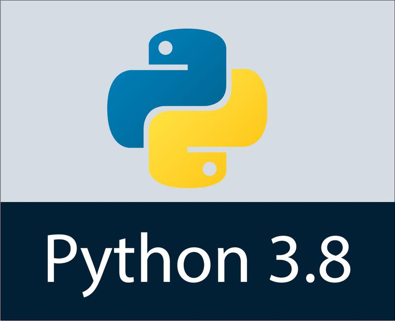

# Curso git
Apreendendo git e github

## Funcionalidade

Apreeender comandos git

# H1
## H2
### H3
#### H4
##### H5
###### H6

## Neglito
**texto neglito** __texto neglito__,

## Italico
*texto italico*  _texto italico_ 

## Lista nao ordenada
* html
* javascripts
* python

## Lista ordenada
1. java
2. htmal
    1. css
    2. javascripts
3. mysql

## Imagem local
